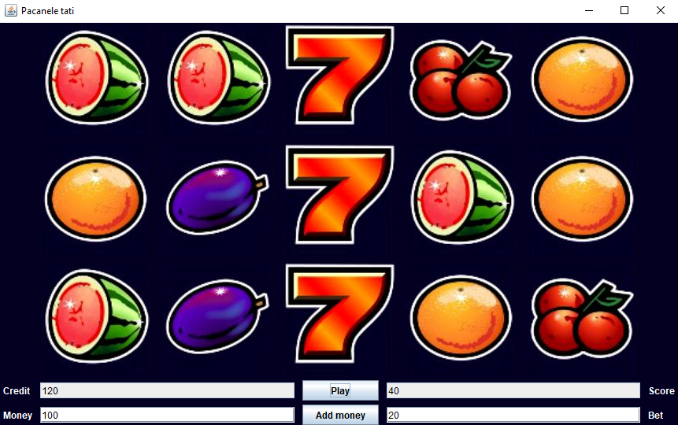

Un joc simplu de slot machine scris in Java.

Nota: am facut acest program in intelliJ IDEA. Este posibil ca in alte IDE-uri acest program sa nu functioneze.

Cum se joaca:

 -Se adauga o suma in caseta text Money si se apasa Add Money

 -Din money Banii se vor transforma in credit egal cu suma adaugata.

 -Se va indica suma pariata in caseta Bet.In continuare se apasa Play.

 -Vor aparea aleatoriu imagini intr-o grila de 3*5 imagini. Daca numarul imaginilor de pe randul din mijloc identice este egal cu cel putin 3
   atunci se adauga la credit scorul, care este egal cu suma pariata*numarul de imagini identice.
   
-Nu se poate paria o suma mai mare decat creditul curent.
   

